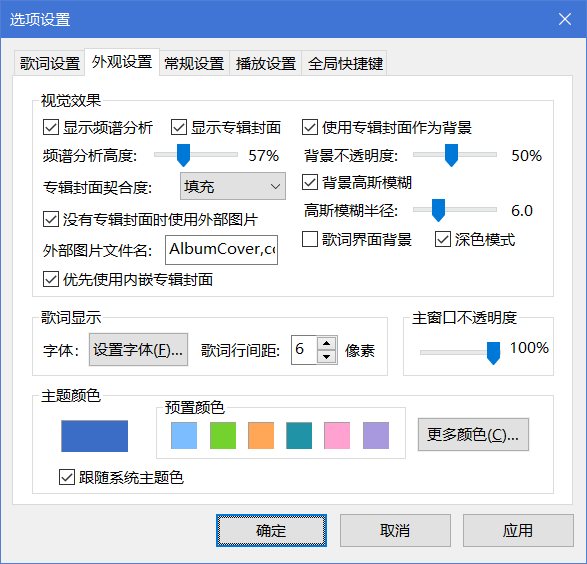
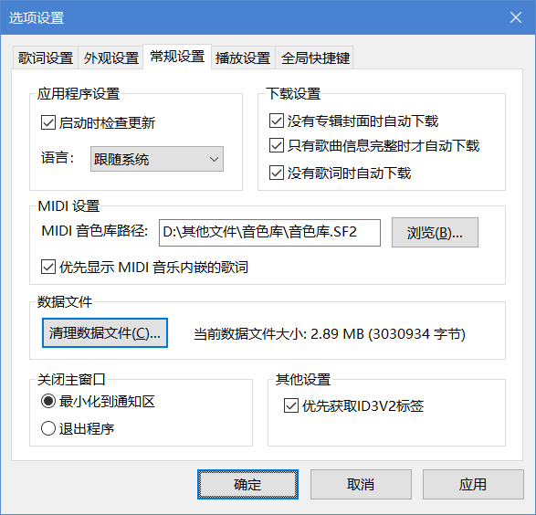

**简体中文 | [English](https://github.com/zhongyang219/MusicPlayer2/blob/master/README_en-us.md)** 

# MusicPlayer2 简介

MusicPlayer2是一款集音乐播放、歌词显示、格式转换等众多功能于一身的音频播放软件。支持歌词显示、歌词卡拉OK样式显示、歌词在线下载、歌词编辑、歌曲标签识别、专辑封面显示、专辑封面在线下载、频谱分析、音效设置、任务栏缩略图按钮、主题颜色、格式转换等功能。播放内核为BASS音频库(V2.4)。播放器支持几乎所有常见的音频格式。

# 相关链接：

请[点击此处](https://github.com/0xHertz/MusicPlayer2/releases)下载MusicPlayer2的最新（简化）版本。

# 主要特性

* 歌词显示
* 迷你模式
* 歌词卡拉OK样式显示
* 任务栏搜索框显示歌词
* 桌面歌词显示
* 歌词在线下载
* 歌词编辑
* 歌曲标签识别和编辑
* 频谱分析
* 专辑封面
* 自动匹配下载歌词和专辑封面
* 音效设置（均衡器和混响）
* 任务栏缩略图按钮
* 主题颜色
* 支持cue分轨
* 背景高斯模糊
* 格式转换
* 媒体库功能

# 使用说明

**[点击这里](https://github.com/zhongyang219/MusicPlayer2/wiki)查看说明文档。**

# 截图

播放器界面支持多种界面切换，支持深色和浅色模式。

主窗口（界面2 推荐界面）▼

主窗口（界面1）▼

主界面（界面2窄界面）▼

主窗口（界面3）▼

主窗口（界面4）▼

主窗口（界面5）▼

迷你模式▼

Cortana搜索框显示歌词▼

桌面歌词▼

选项设置——外观设置▼

选项设置——常规设置▼

